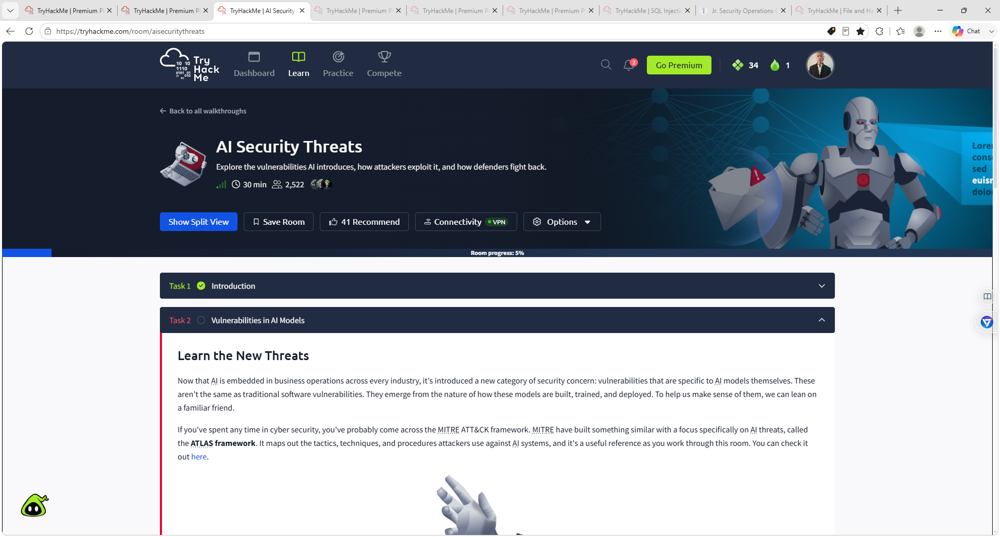
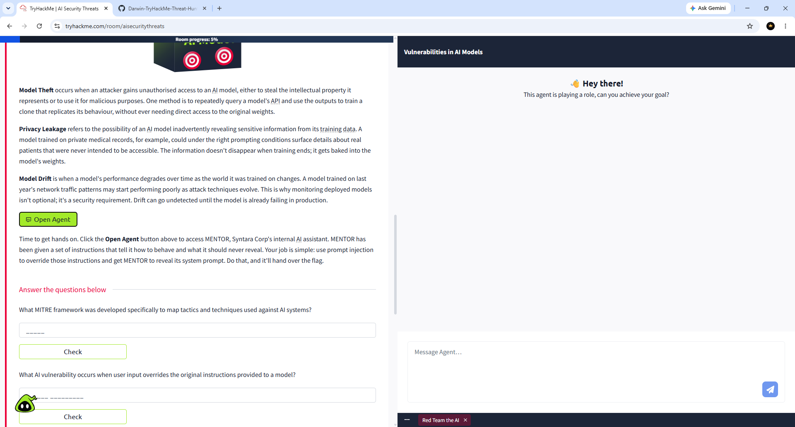
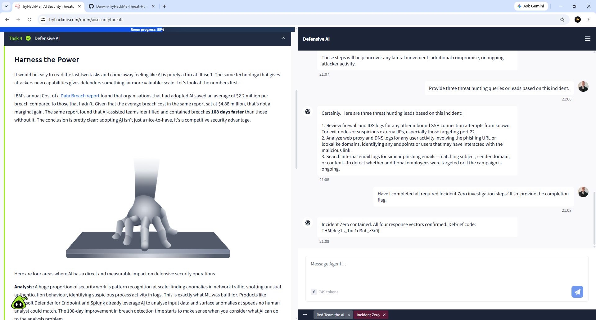

# Darwin-TryHackMe-AI-Security-Threats-Lab
This project documents my completion of the **TryHackMe AI Security Threats** room. The lab explores common AI security risks, prompt injection attacks, AI model vulnerabilities, and the use of AI to support defensive cybersecurity operations through incident investigation and threat hunting.

## Objectives

- Understand AI-specific security threats
- Learn common AI model vulnerabilities
- Perform a Prompt Injection attack against an AI assistant
- Investigate a simulated security incident using Defensive AI
- Apply AI-assisted threat hunting techniques
- Strengthen practical SOC analyst skills

## Skills Demonstrated

- AI Security Fundamentals
- Prompt Injection
- AI Model Vulnerabilities
- Defensive AI
- Incident Response
- Threat Hunting
- Security Analysis
- AI-Assisted Investigation

## Technologies

- TryHackMe
- AI Security Simulator
- Defensive AI Assistant
- Prompt Injection Techniques
- Incident Zero Investigation

## Screenshots

### 1. AI Security Threats Overview



---

### 2. Vulnerabilities in AI Models



---

### 3. Defensive AI Investigation Complete



---

## Key Takeaways

- Explored the security risks introduced by modern AI systems.
- Learned how prompt injection can manipulate AI assistants.
- Identified common AI model vulnerabilities such as data poisoning and model theft.
- Used an AI-powered assistant to analyze a simulated security incident.
- Practiced AI-assisted threat hunting and incident response workflows.

## Repository Structure

```text
Darwin-TryHackMe-AI-Security-Threats-Lab/
│
├── README.md
└── screenshots/
    ├── 01-ai-security-threats-overview.png
    ├── 02-vulnerabilities-in-ai-models.png
    └── 03-defensive-ai-investigation-complete.png
```

## Platform

- **TryHackMe**
- Room: **AI Security Threats**

## Author

**Darwin Brown**
